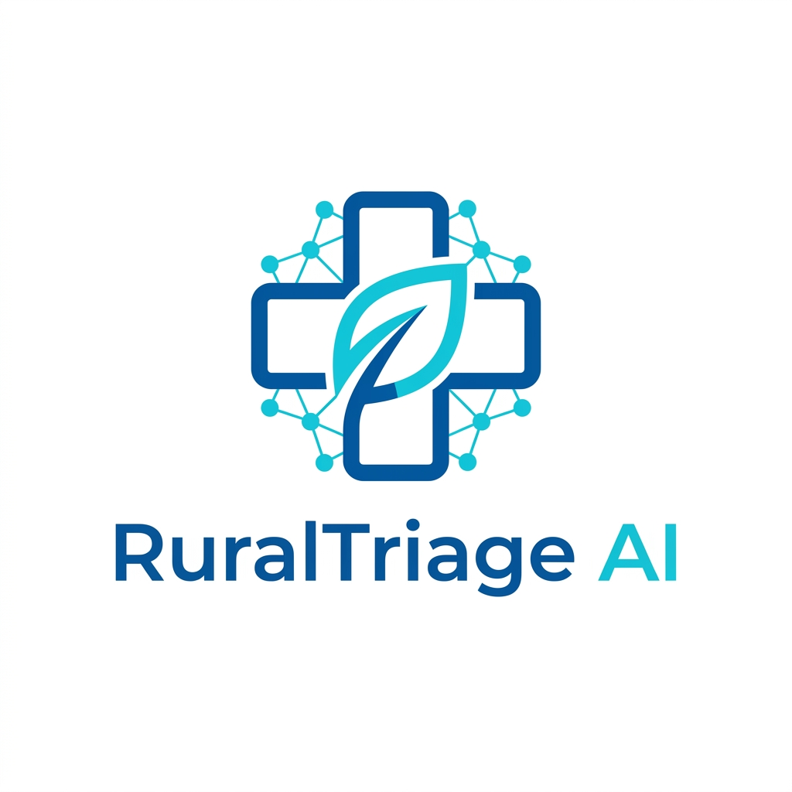

# 🏥 RuralTriage AI

### "AI-Powered Rural Healthcare Triage & Telemedicine Platform"

<p align="center">
  
</p>

<p align="center">
  
  
  
  
  
  
  
  
  
</p>

---

## 📖 Project Overview

**RuralTriage AI** is a comprehensive clinical decision support system designed specifically to bridge the healthcare gap in remote and rural areas. In regions where specialist doctors are scarce, our platform empowers local practitioners and patients with state-of-the-art AI diagnostics.

### The Problem
Rural healthcare often suffers from delayed triage, leading to preventable complications. Patients often travel long distances for minor issues or, conversely, delay seeking care for life-threatening emergencies.

### The Solution
By integrating **Advanced LLMs (Groq)** and **Vision Analysis**, RuralTriage AI provides immediate, clinical-grade triage decisions—identifying whether a case can be treated locally or requires urgent referral to a higher hospital.

---

## 🚀 Key Features

### 🧠 AI Triage System
*   **Symptom Analysis**: Natural language processing to understand complex patient complaints.
*   **Risk Level Detection**: Automated categorization from Low to Critical.
*   **Final Decision Logic**: Clear instructions (Treat Locally, Monitor, or Refer) with AI-backed reasoning.

### 🚨 Emergency Alert System
*   **Critical Detection**: Automatically flags life-threatening indicators (chest pain, shortness of breath).
*   **Priority Queue**: Ensures urgent cases are highlighted at the top of the doctor's dashboard.

### 📡 Offline-First & Local Sandbox
*   **Resilient Design**: Works in low-connectivity areas.
*   **Sandbox Mode**: Automatically switches to local server storage if cloud services (Cloudinary) are unreachable.

### 👨‍⚕️ Doctor Dashboard
*   **Patient Registry**: Real-time queue and medical history.
*   **Digital Prescriptions**: Instant generation and dispatch of e-prescriptions.
*   **Clinical Tools**: Direct access to patient triage data and medical documents.

### 💊 Pharmacy System
*   **Inventory Control**: Full tracking of medicine stock, categories, and manufacturers.
*   **Dispensary Workflow**: One-click processing of incoming digital prescriptions.

### 📁 Health Records
*   **Centralized Repository**: Securely upload and manage X-Rays, Lab Reports, and history.
*   **AI Interpretation**: Explains complex medical reports in simple, patient-friendly language.

---

## 🛠️ Tech Stack

### **Frontend**
- **React 18**: Modern UI logic and component architecture.
- **TypeScript**: Type-safe development.
- **Tailwind CSS**: High-performance, responsive styling.
- **Framer Motion**: Professional, high-fps interface animations.

### **Backend**
- **FastAPI**: High-performance asynchronous API framework.
- **SQLAlchemy**: Robust SQL ORM for data persistence.
- **SQLite / PostgreSQL**: Flexible database support.

### **AI & Cloud**
- **Groq API**: High-speed inference for Llama-3 (Symptom analysis).
- **Cloudinary**: Dedicated cloud storage for medical files and images.

---

## 🏗️ Project Structure

```text
RuralTriage_AI/
├── backend/                # FastAPI Application
│   ├── app/
│   │   ├── main.py         # Entry point & app configuration
│   │   ├── models.py       # SQL Database models
│   │   ├── routes/         # API endpoint definitions (Auth, Patient, Doctor)
│   │   ├── services/       # Business logic & AI Integrations 
│   │   ├── schemas/        # Pydantic data validation models
│   │   └── config/         # Environment & Settings management
│   ├── static/             # Local sandbox storage for uploads
│   └── requirements.txt    # Python dependencies
│
├── frontend/               # React SPA
│   ├── src/
│   │   ├── app/
│   │   │   ├── components/ # Reusable UI components (Layout, Auth)
│   │   │   ├── pages/      # Feature-specific pages (Triage, Dashboard)
│   │   │   └── routes.tsx  # React Router navigation
│   ├── public/             # Static assets (logo, icons)
│   └── vite.config.ts      # Build tool & proxy configuration
```

---

## ⚙️ Installation & Setup

### **Backend (Terminal 1)**
1. Navigate to backend: `cd backend`
2. Install dependencies: `pip install -r requirements.txt`
3. Launch server: `python -m uvicorn app.main:app --reload`
   *   **Port**: `http://localhost:8000`

### **Frontend (Terminal 2)**
1. Navigate to frontend: `cd frontend`
2. Install dependencies: `npm install`
3. Launch dev server: `npm run dev`
   *   **Port**: `http://localhost:5173`

---

## 🔑 Environment Variables

Create a file named `dev.env` in `backend/app/config/` with the following:

*   `GROQ_API_KEY`: Required for AI symptom analysis and triage.
*   `CLOUDINARY_URL`: Required for cloud storage. (System defaults to local sandbox if missing).
*   `DATABASE_URL`: Connection string for the database (e.g., `sqlite:///./test.db`).

---

## 📡 System Architecture

1.  **Client-Side**: React SPA handles routing and state.
2.  **API Gateway**: Vite Proxy handles secure traffic between frontend and backend.
3.  **Core API**: FastAPI processes requests and manages the SQLite/PostgreSQL database.
4.  **AI Layer**: Groq API provides real-time clinical inference.
5.  **Storage Hub**: Intelligent logic chooses between Cloudinary (Online) and Local (Sandbox) for files.

---

## 🔄 Workflow

**Patient** inputs symptoms → **AI Engine** runs diagnosis → **Final Decision** (Treat/Refer)  
→ **Doctor** reviews triage in dashboard → **Prescription** issued  
→ **Pharmacy** receives e-prescription → **Medicine** dispensed.

---

## 🧪 How to Use

1.  **Login**: Access as a Patient or Doctor.
2.  **Triage**: Use "Check Symptoms" to receive an immediate AI assessment.
3.  **Consult**: If referred, use "Talk to Doctor" to set up a session.
4.  **Records**: Upload your reports in "Health Records" for AI explanation.
5.  **Medicine**: Find your prescribed medicines in the integrated pharmacy search.

---

## 📊 Future Improvements

- [ ] **AI-Based Prescriptions**: Automated initial suggestions for common conditions.
- [ ] **Real-Time SMS Alerts**: Instant notification for emergency referrals.
- [ ] **Geospatial Tracking**: Automated hospital finding based on GPS location.

---

## 📄 License
This project is released under the **MIT License**. See `LICENSE` for details.

---

### *Bridging the distance between patients and specialists with intelligence.*
